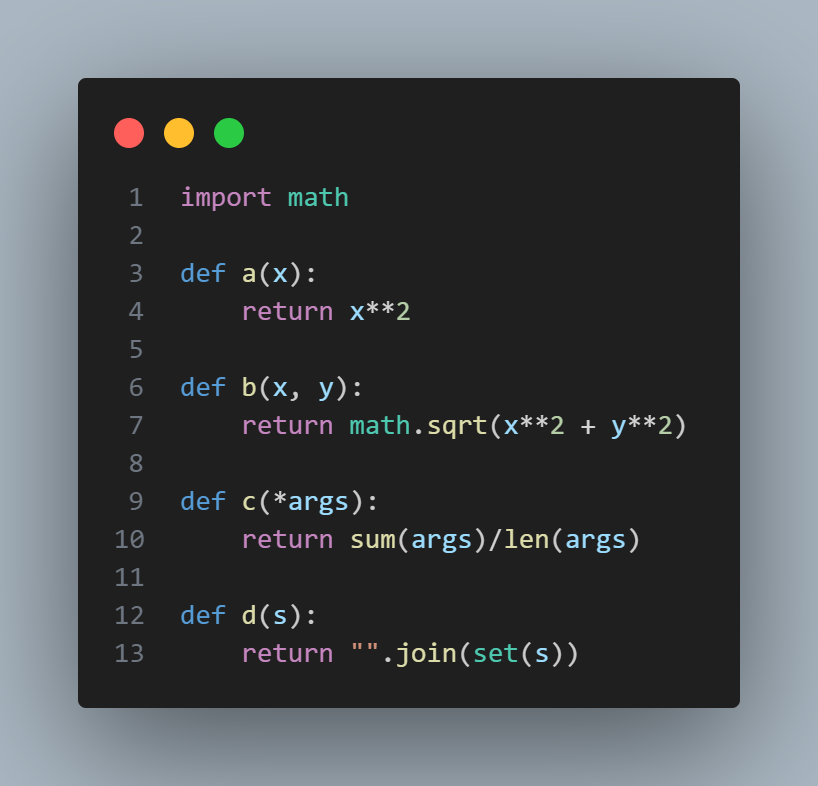
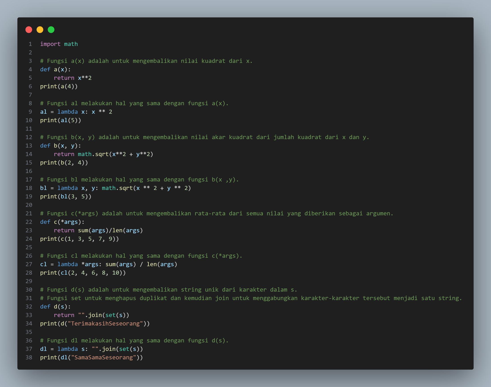
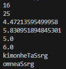
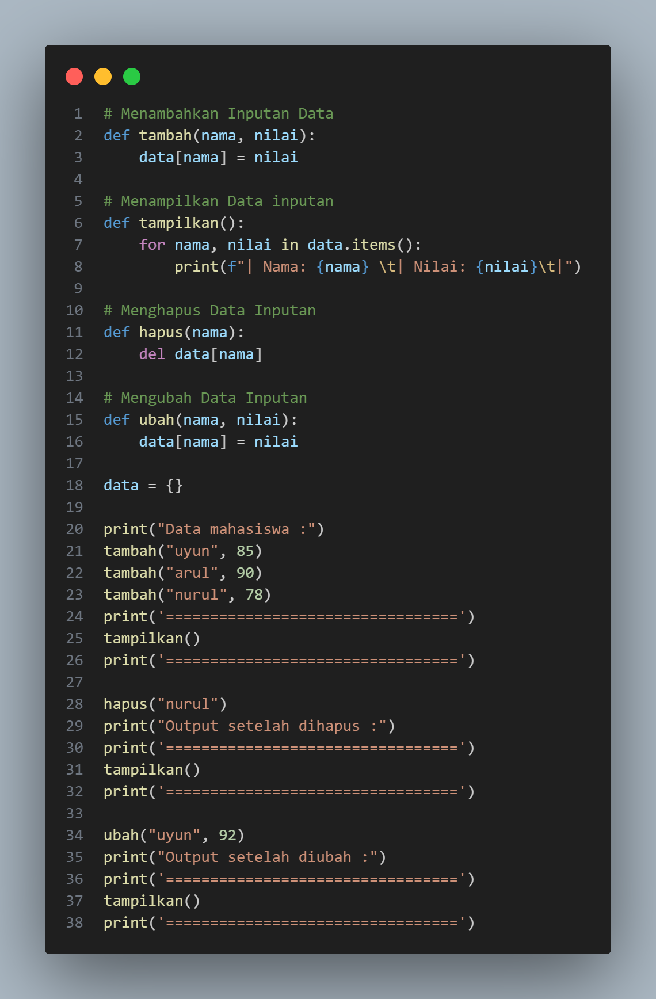
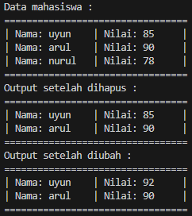
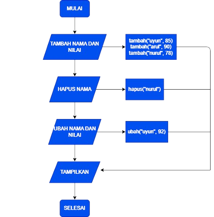

# Pertemuan 11

## Profil
| Variable | Isi |
| -------- | --- |
| **Nama** |Muhammad Nurul Firdaus |
| **NIM** | 312310495 |
| **Kelas** | TI.23.A.5 |
| **Mata Kuliah** | Bahasa Pemrograman |

## Latihan
### Ubahlah kode dibawah ini menjadi fungsi lambda :

### Setelah diubah menjadi fungsi lambda :

### Outputnya :

# Tugas Praktikum
## Buat program sederhana dengan mengaplikasikan penggunaan fungsi yang akan menampilkan daftar nilai mahasiswa, dengan ketentuan:
* Fungsi tambah() untuk menambah data
* Fungsi tampilkan() untuk menampilkan data
* Fungsi hapus(nama) untuk menghapus data berdasarkan nama
* Fungsi ubah(nama) untuk mengubah data berdasarkan nama

### Programnya :

### Outputnya :

### Flowchartnya :

